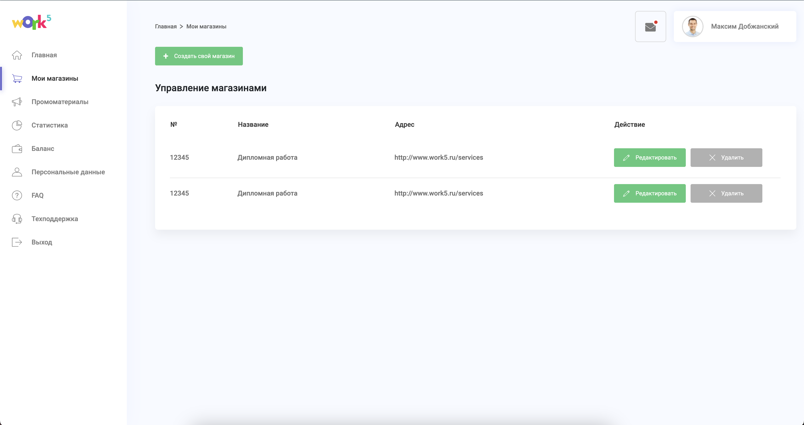

# Work5 - Мои магазины



## ВАЖНО! Для запуска необходима 16 версия node.js и пакетный менеджер yarn
### Чтобы сменить версию node.js нужен nvm
Скачать можно здесь: https://github.com/coreybutler/nvm-windows/releases

Чтобы сменить версию node.js нужно выполить следующие команды
```
nvm install 16
```
```
nvm use 16
```

### Установка необходимых пакетов
```
yarn install
```

### Запуск проекта
```
yarn serve
```